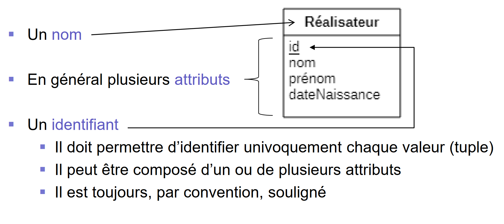

# Modèle EA

## Avantages du modèle EA

- Permet assez simplement de **modéliser** des problèmes comme l’exemple précédent mais aussi de beaucoup plus complexes
- Offre une **représentation graphique** basée sur des conventionsprécises mais relativement simples à comprendre pour tous lesintervenants d’un projet (aussi les clients)
- Supporté par beaucoup de logiciels (StarUML, …)
- Certains permettent de générer automatiquement le modèle relationnel voir le code SQL (par exemple PowerDesigner)

## Désavantages du modèle EA

- **Non-déterministe** car il n’y a pas de règles absolues pour déterminer ce qui doit être entité, association ou attribut
- **Ne permet pas toujours de représenter toutes les contraintes sémantiques**, notamment les intégrités (référentielles et sur les données)
- Par exemple qu’une date de naissance ne doit pas être dans le futur
- Il existe plusieurs **conventions** de représentation graphique (notamment UML et MERISE), qui ont parfois des **différences fondamentales** (positionnement des cardinalités)

## Les concepts du modèle EA
- Type d’entité
- Attribut
- Identifiant (ou clé)
- Association
- Cardinalité (ou multiplicité)
- Rôle

## Type d’Entité

Chaque type d’entité a :

Un type d’entité est aussi souvent appelé simplement "entité".
