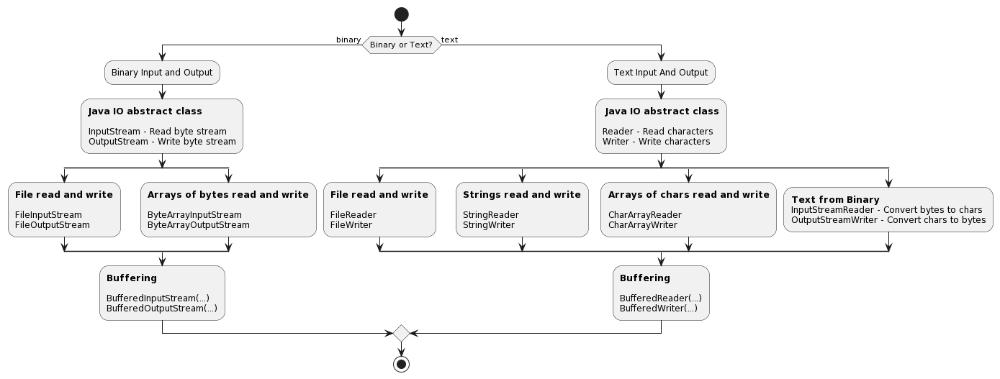

# Java IOs

## Traitement des données binaires vs données texte

Il existe deux principaux types de données que vous pouvez traiter : les données binaires et le texte.

Le traitement des données binaires est le type de traitement de données le plus basique : vous ouvrez
un fichier, vous lisez les bits et vous écrivez les bits dans un autre fichier. 
Vous ne devez pas interpréter les bits, vous les copiez simplement.

Quelle est la différence entre les données binaires et les données texte ?

Les ordinateurs ne comprennent que les données binaires. Les données binaires sont une séquence de bits
(0 et 1). Les données binaires peuvent représenter n'importe quoi : du texte, des images, des vidéos, etc.
le système de fichiers, tout est des données binaires.

La vraie question est : comment interprétons-nous ces éléments ?

### Ancêtre de la représentation des caractères : ASCII

**L'American Standard Code for Information Interchange (ASCII)** est l'un des
les premiers codages de caractères. C'est un codage de caractères qui mappe 128
valeurs binaires à 128 caractères. Par exemple, la donnée binaire 01000001 est
mappé sur le caractère A.

La première implémentation de l'ASCII a été publiée en 1963. Elle était censée être
utilisé uniquement pour la langue anglaise. Il a ensuite été étendu pour prendre en charge d'autres
langues.

### ASCII étendu : pages de codes

Comme ASCII est un codage de caractères très limité (seulement 8 bits, laissant 128 autres
valeurs possibles), de nombreux autres codages de caractères ont été créés pour prendre en charge
plus de caractères et de langues.

Ces codages de caractères ASCII étendus sont appelés **code pages**. Ils ont été créés
puis normalisés par **l'Organisation internationale de normalisation (International Organization for Standardization -> ISO).**

Les **code pages** courantes sont ISO-8859-1 (également appelée Latin-1), ISO-8859-15 (également appelée Latin-1).
appelé Latin-9), Windows-1252 (également appelé CP1252), etc.

### Unicode

**Unicode** est une nouvelle norme de codage de caractères destinée à **résoudre
les problèmes d'ASCII et des code pages** qui ne pouvaient pas supporter toutes les spécificités de toutes les langues:

- Langues de plus de 256 caractères (comme le chinois)
- Langues avec plus d'un alphabet (comme le serbe)
- Langues avec plus d'un système d'écriture (comme le chinois ou le japonais)
  
La spécification Unicode définit **1 112 064 caractères**.

C'est suffisant pour **prendre en charge toutes les langues du monde ainsi que les emojis**.

Les implémentations du standard Unicode sont appelées Unicode
Transformation Formats (UTF). L'implémentation la plus courante est **UTF-8**.

### UTF-8

**UTF-8** est un codage de caractères de longueur variable qui utilise 1 à 4 octets pour
encoder un caractère. C'est l'implémentation la plus courante d'Unicode
standard. Il s'agit de l'encodage de caractères par défaut sur Internet et de nombreuses
autres applications.

UTF-8 est **rétrocompatible** avec ASCII. Cela signifie que si vous avez un fichier
encodé en ASCII, il est également encodé en UTF-8.

| Binary data                                 | Meaning           |
| ------------------------------------------- | ----------------- |
| `0xxxxxxx`                                  | 1 byte character  |
| `110xxxxx` `10xxxxxx`                       | 2 bytes character |
| `1110xxxx` `10xxxxxx` `10xxxxxx`            | 3 bytes character |
| `11110xxx` `10xxxxxx` `10xxxxxx` `10xxxxxx` | 4 bytes character |

Comme certains bits sont utilisés pour coder la longueur du caractère, le nombre de caractères possibles est limité, d'où la limite de 1 112 064 caractères.

D'autres implémentations de la norme Unicode existent, telles que UTF-16 et UTF-32.
Ils ne sont pas aussi courants que UTF-8 et ne sont **pas** rétrocompatibles avec ASCII.

Les strings Java, par exemple, utilisent UTF-16, ce qui signifie qu'un caractère est codé sur 2 octets
(en C/C++, un caractère est codé sur 1 octet).

### Que se passe-t-il si vous ignorez l'encodage des caractères ?

Lorsque vous ouvrez un fichier, vous devez connaître l'encodage des caractères utilisé pour decoder le fichier.

Le codage des caractères n'est généralement pas stocké dans le fichier. Vous devez le savoir à l'avance pour pouvoir lire correctement le fichier.

Lorsque le codage des caractères n'est pas connu à l'avance ou est mal interprété, il peut
entraîner des problèmes tels que l'affichage de mauvais caractères ou l'impossibilité d'afficher
les caractères.

Un bon exemple est lorsque vous ouvrez un fichier texte codé en UTF-8 avec un éditeur de texte
qui ne prend pas en charge UTF-8. L'éditeur de texte tentera d'interpréter le fichier comme
ASCII et affichera les mauvais caractères (`é` au lieu de `é` par exemple).

### Caractères de fin de ligne

Une autre chose importante à savoir lorsqu'on traite des fichiers texte est de connaître le caractère de **fin de ligne**.

Le caractère de fin de ligne est un caractère spécial qui marque la fin d'une ligne.

Il existe différents caractères de fin de ligne selon le système d'exploitation :

- Unix/Linux/macOS : `\n'`, appelé Saut de ligne (Line feed -> `LF`)
- Windows : `'\r\n'`, appelé Retour Chariot + Saut de ligne (Carriage Return + Line feed -> `CR`+`LF`)

Lorsque vous lisez un fichier texte ligne par ligne, le string que vous obtenez ne contiendra **pas**
le(s) caractère(s) de fin de ligne. Vous devez l'ajouter vous-même si vous voulez écrire le string dans un autre fichier.

### Une note rapide sur le little endian et le big endian

Lorsque vous travaillez avec des données binaires, vous devez savoir si les données sont encodées en
**little endian** ou en **big endian**.

**Little endian** signifie que l'octet de poids faible est stocké en premier. **Big
endian** signifie que l'octet de poids fort est stocké en premier.

Par exemple, le nombre « `0x12345678` » est stocké sous la forme « `0x78 0x56 0x34 0x12` » dans
**little endian** et sous la forme `0x12 0x34 0x56 0x78` en **big endian**.

Ceci est important à savoir lorsque vous lisez ou écrivez des données binaires. Si vous lisez ou
écrivez des données binaires dans le mauvais endian, les données seront corrompues.

Java utilise le **big endian par défaut**. Vous pouvez utiliser Little Endian en utilisant le
Classe `ByteBuffer`.

## Sources, streams et sink de données

Chaque fois que vous souhaitez lire ou écrire des données, vous devez disposer d'une source de données et d'un
sink de données, en utilisant un stream pour laisser les données circuler de la source vers le sink.

Cette représentation est une abstraction du monde réel. C'est une façon de
représentent le stream de données d’un endroit à un autre.

Une **source de données** est **l'endroit d'où proviennent les données**. Cela peut être un fichier, un
connexion réseau, un clavier, etc. Un terme stream pour une source de données est
quelque chose qui **produit** des données (**un producteur**).

Un **sink de données** est **l'endroit où vont les données**. Cela peut être un autre fichier, un réseau
connexion, un écran, etc. Un terme stream pour un sink de données est quelque chose qui
**consomme** des données (**un consommateur**).

Un **stream** est **un moyen de lire ou d'écrire des données** depuis ou vers une source ou un sink.

## L'API Java IO

La [documentation Java](https://docs.oracle.com/en/java/javase/17/docs/api/) est
séparés en modules. L'API Java IO fait partie du module `java.base`.

Dans le module `java.base`, il existe deux packages principaux pour lire et écrire des données :

- `java.io` : l'API Java IO standard
- `java.nio` : l'API Java NIO

Le package `java.io` est appelé **Java IO API** ou **standard Java IO API**.

L'**API Java NIO** a été introduite dans Java 1.4. Il s'agit d'une API plus moderne qui
peut être plus efficace et plus flexible que l'API Java IO dans certains cas d'utilisation.
Il est également plus complexe à utiliser et s'adresse à des cas d'usage plus avancés (écriture
serveurs évolutifs par exemple).

La documentation de l'API Java IO est assez complexe. Ce n'est pas facile à trouver
la bonne classe à utiliser pour le bon cas d'utilisation.

Vous devrez peut-être vérifier plusieurs classes avant de trouver la bonne.

### Performances et mise en mémoire dans un buffer

Lors de la lecture et de l'écriture de données, les données peuvent être lues ou écrites octet par octet ou en utilisant
un buffer.

Si vous n'utilisez pas d'E/S bufferisées, appeler `read()` qui émettra un appel système à
récupérer un seul octet... ce qui n'est pas efficace.

Avec les E/S mises en mémoire bufferisées, appeler `read()` qui pré-récupèrera "plusieurs" octets et les stockera
dans un espace mémoire temporaire (c'est-à-dire dans un buffer).

"Several" définit la taille du buffer. Les appels ultérieurs à `read()` pourront
récupérer les octets directement à partir du buffer, ce qui est très rapide.

Lorsque le buffer est vide, un nouvel appel système sera émis pour récupérer plus d'octets.

Si le buffer est plein, un nouvel appel système sera émis pour vider le buffer.

Si le buffer est à moitié plein, il doit être vidé avant de pouvoir être rempli à nouveau.

Appeler `close()` qui videra également automatiquement le buffer, mais parfois vous
souhaitez vider le buffer sans fermer le fichier pour des raisons de performances.

Si vous voulez être sûr que toutes les données sont écrites dans le fichier, vous devez appeler
`flush()` manuellement. Appeler `flush()` qui effectuera un appel système pour écrire le
contenu du buffer dans le fichier et videz le buffer.

### Gérer les erreurs

Lorsque vous utilisez l'API Java IO, vous devez ouvrir et fermer un fichier avant et après
lire ou écrire des données.

Si vous ne fermez pas correctement le fichier, vous risquez de perdre des données ou de corrompre le fichier.

Lors de l’accès à un fichier, de nombreuses choses peuvent mal se passer. Le fichier n'existe peut-être pas, le
le fichier peut être corrompu, le fichier peut être verrouillé par un autre processus, etc.

Lorsque vous ouvrez un fichier, vous devez gérer ces erreurs. Vous pouvez le faire en
lancant l'exception `IOException`. Cela se fait avec un
bloc `try`/`catch`/`finally` ou, plus récemment, avec un bloc `try-with-resources`.
L'utilisation du bloc `try-with-resources` est la meilleure façon de gérer
les erreurs car il est plus concis et moins sujet aux erreurs.

Les exceptions courantes que vous pourriez rencontrer sont :

- `FileNotFoundException` : le fichier n'existe pas
- `IOException` : le fichier n'est pas accessible pour d'autres raisons
- `UnsupportedEncodingException` : le fichier est encodé dans un format d'encodage de caractère non supporté

Il en va de même lorsque vous utilisez le réseau : le réseau peut être en panne, le
la connexion pourrait être perdue, etc.

Vous devrez gérer ces erreurs lorsque vous travaillerez avec le réseau.

### Quand utiliser quelle IO ?

L'API Java IO est très puissante. Elle peut être utilisé pour lire et écrire des données depuis et
vers différentes sources et sink de données en utilisant différents types de streams.

Il peut parfois être difficile de savoir quelle E/S utiliser pour quel cas d'utilisation.

Voici un arbre de décision simple pour vous aider à choisir la bonne IO pour la bonne utilisation
cas:

